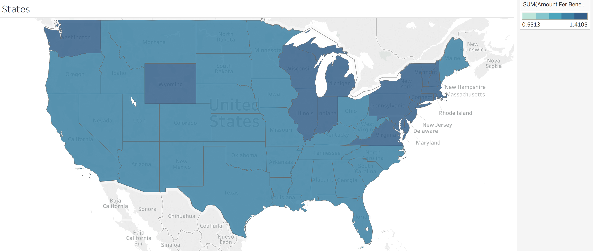
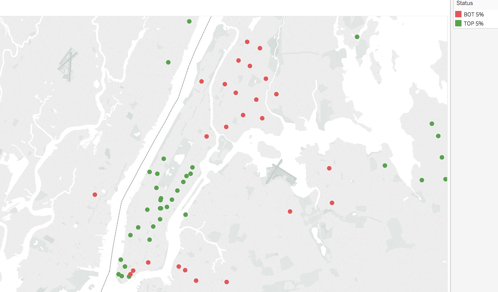

# A6 : Social Security Benefits Analysis 
Lohith B R
DATA 512 Final Project
University of Washington, Fall 2018 

## Introduction 
Social Security has become very important these days epecially in a developed country like the United States. Income derived from Social Security is currently estimated to have reduced the poverty rate for Americans age 65 or older from about 40% to below 10%.[9]. In 2018, the trustees of the Social Security Trust Fund reported that the program will become financially insolvent in the year 2034.[10]. Thus it is very important that we analyze where the money is going and see if there are better ways to solve some of the problems instead of directly paying the beneficiaries. For e.g. it may be a good idea to invest more upgrading or reforming the health care system to reduce the cost of health care per person. It is also important to identify and prevent Social Security Fraud. This analysis can, in theory, help decision makers make informed decisions.

The annual publication of OASDI(Old-Age, Survivors & Disability Insurance) benefits from the Social Security Administration (SSA) presents the basic program data on the number and type of beneficiaries and the amount of benefits paid each state at the ZIP code level. This dataset also shows the number of men and women aged 65 or older receiving benefits. This dataset contains only those persons to whom the benefits are payable. Those whose benefits were withheld are excluded. 

This dataset will be used in this analysis to answer some of the research questions and also, if possible, uncover some interesting patterns/insights.

## Reproducibility
This Analysis is completelty reproducible if you have the dataset, the code and the tools and libraries used in this analysis. The piece of code you see in this notebook will take care of all the data processing and producing the necessary output CSV files. However, for better visualization I have used Tableau instead of matplotlib or seaborn library. Please find the links in the references to see how to use Tableau to visualize the data the way I did it. 

## Research Questions Posed 
1.  What Zip codes have some of the lowest/highest amount received per month and how does that compare with the annual average house hold income in that zip code?
    #### comments
    * Let's take a look at the zip code 77010 in Texas where on an average the beneficiaries get nearly 2,155 dollars per month
    * The average household income in this zip code is nearly 250,001 dollars [6]
    * Though there are exceptions, it's not hard to see that zip codes that have very high household incomes also tend to collect more benefits from the SSA
    * Let's take a look at the zip code 80231 in Colorado where on an average the beneficiaries get nearly 300 dollars per month
    * The average household income in this zip code is nearly 51,099 dollars [6]
    * Again, though there are exceptions, it's not hard to see that zip codes that have very low household incomes also tend to collect less benefits from the SSA
2. What states have some of the lowest/highest amount received per month and is there an apparent trend in the data?
    * 
    #### Comments
    * Even though there is a wide range of possible values of average benefits per state and even some states standout, it's hard to find correlations with any other idicators like income level or poverty.
    * It can be concluded that SS benefits have to be looked at a more granular level than at a State level
3. Are there parts of the cities/towns where top and botton beneficiaries live close to each other?
    * Since it's unweildy to look at every town/city in the country, we will focus on New York city for this analysis.
    * In particular we will look at Bronx and Manhattan boroughs in NYC
    * 

Please refer to the notebook final_project.ipynb for a complete analysis and visualizations

## Files in this Repository
|  File Name | Type  | Description   |
|---|---|---|
| DATA 512 - Final Presentation.pdf  | PDF  | pdf version of the slides presented in class  |
|LICENSE   | TXT  | This file contains the licensing information for this project  |
| state_details.csv  |  CSV |  state level details of benefits : used as input for Tableau |
| extremes_5.csv  | CSV  | Top and botton 5% zip-codes in terms of avg benefits : inupt for Tableau |
| final_project.ipynb  | Jupyter Notebook  | This notebook contains all the code and instructions for the analysis  |
| final_project_plan.md  |  Markdown | The project plan   |
| nyc.png  | PNG  |  Visualization of NYC with respect to top and botton 5% |
| oasdi_zip16.xlsx  |  MS Excel |  Input data for this analysis |
| states.png  | PNG  | State level average benefits visualization  |

## Tools and Libraries Needed for Reproducibility
* Tableau Public Desktop Version : 2018.2.3 64-bit [1]
* Python Version : Python 3.6.5 |Anaconda, Inc.| [7]
* Python Numpy version : 1.12.1 [3]
* Pandas Version : 0.23.1 [4]

## Metadata for the dataset

|  Attribute | Value  |
|---|---|
|  Last Updated | December 2, 2017  |
|  Created |  December 2, 2017 |
|  File Format | MS Excel  |
|  License | [Creative Commons CCZero](https://creativecommons.org/publicdomain/zero/1.0/legalcode)  |
| Number of sheets  | 56  |
|  ID | 2d66781f-0590-4cee-95ea-d8ab01e08e03  |
| Revision ID | c745f739-adee-4936-b575-9cc44548e45a |
| Raw File Size | 3.4 MB|

* Every sheet either corresponds to a State or a territory in the US
* Every sheet has the following data format

|  Headers  |Data Type / Description   |
|---|---|
| Field Office and Zip Code  | Text(either field office name or ZIP code)  |
| Total  | Text(denoting a comma seperated number)  |
| Retired workers  |  Text(denoting a comma seperated number) |
| Disabled Workers  | Text(denoting a comma seperated number)  |
| Widow(er)s and parents  | Text(denoting a comma seperated number)  |
| Spouses | Text(denoting a comma seperated number)  |
| Children  | Text(denoting a comma seperated number)  |
| All Beneficiaries  | Text(denoting a comma separated number in terms of thousands of dollars)  |
| Retired Workers  |  Text(denoting a comma separated number in terms of thousands of dollars) |
| Widow(er)s and parents  | Text(denoting a comma separated number in terms of thousands of dollars)  |
| Number of OASDI beneficiaries aged 65 or older | Text(denoting a comma seperated number)  |

## Final Comments after the Analysis
* A lot of rich people, who probably don't need SS benefits are availing them
* Eligibility criteria for SS benefits should change to take into account not just taxable income but the total value of assets at the time the claims are made

## Future work
* Combine this dataset with Income/wealth data and do further analysis
* Combine this dataset with zip code wise racial and gender distribution of data and find patterns if any
* Is it possible to find cases of widespread fraud using these datasets?

## References 
[1] https://public.tableau.com/en-us/s/
 
[2] https://catalog.data.gov/dataset/oasdi-beneficiaries-by-state-and-zip-code-2016
 
[3] https://docs.scipy.org/doc/
 
[4] https://pandas.pydata.org/pandas-docs/stable/
 
[5] https://creativecommons.org/publicdomain/zero/1.0/legalcode
 
[6] https://www.incomebyzipcode.com/
 
[7] https://www.anaconda.com/download/#macos
 
[8] https://www.tableau.com/learn/training
 
[9] https://www.cbpp.org/research/social-security/social-security-keeps-22-million-americans-out-of-poverty-a-state-by-state
 
[10] https://www.ssa.gov/oact/tr/2018/tr2018.pdf